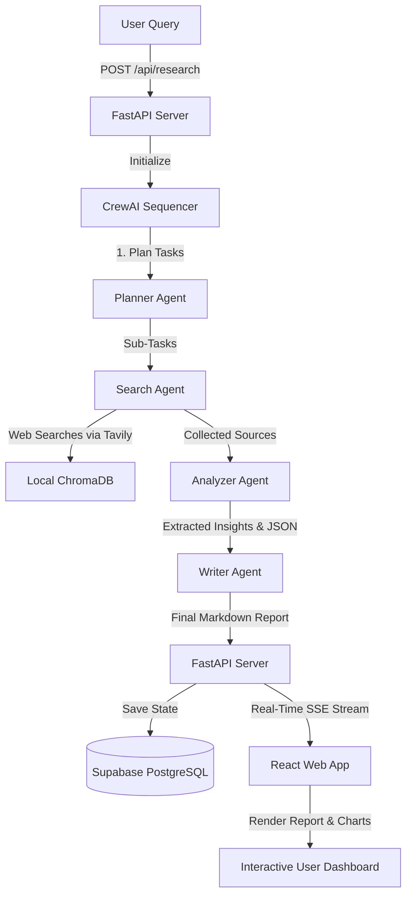

# 🔍 Multi-Agent Research Assistant

An AI-powered, production-ready research platform that orchestrates multiple specialized agents using **CrewAI**, **FastAPI**, and **React**. The system accepts complex research topics, breaks them down into sub-tasks, conducts real-time web searches, analyzes the findings, generates a professional Markdown report, and formats quantitative key metrics into visual charts.

---

## 🚀 Key Features

- **Specialized Multi-Agent Crew:** Powered by CrewAI and Groq's high-speed LPU inference (`llama-3.3-70b-versatile`), coordinating 4 unique agents:
  - 📝 **Planner Agent:** Decomposes broad research topics into a structured, execution-ready outline of sub-tasks.
  - 🔍 **Search Agent:** Conducts live, targeted web searches using Tavily Search API.
  - 📊 **Analyzer Agent:** Synthesizes findings, resolves contradictions, extracts statistics, and outputs chart data.
  - ✍️ **Writer Agent:** Assembles the synthesized insights into a comprehensive, publication-grade report.
- **Server-Sent Events (SSE):** Streaming progress updates from the backend to the frontend in real time, so users can watch the agents think, search, analyze, and write.
- **Dynamic Visualizations:** Automatically extracts structured JSON data from agent analyses and renders interactive charts (Bar & Doughnut) using Chart.js.
- **Semantic Vector Storage:** Features a local **ChromaDB** database vector store to save and search collected documents semantically.
- **Secure Authentication & Session History:** Integrates **Supabase Auth** and Database with Row Level Security (RLS) to manage user accounts and sync research histories securely.
- **Rich User Interface:** Modern React frontend featuring a dark-themed glassmorphic design, subtle micro-animations, glowing background gradients, and direct PDF/Markdown exports.

---

## 📐 Architecture & Workflow

The research assistant coordinates sequentially across components to build high-quality research output:



1. **Planner Agent:** Receives the broad topic (e.g., *"Ethical Implications of AI"*) and splits it into 3 to 5 targeted research tasks.
2. **Search Agent:** Loops through the sub-tasks, generating queries to crawl the web using Tavily Search. Results are structured and stored locally in ChromaDB for future semantic similarity matching.
3. **Analyzer Agent:** Analyzes the search corpus, highlights debates or contradictions, and builds a strict JSON payload under a `## Visualization Data` section.
4. **Writer Agent:** Compiles everything into a clean Markdown document complete with inline citation numbers (e.g., `[1]`, `[2]`) referencing a compiled bibliography.

---

## 🛠️ Prerequisites

Before you start, make sure you have:
- **Python 3.10 to 3.12** installed on your machine.
- **Node.js (v18+)** and `npm` installed.
- A **Groq Cloud API Key** (register free at [console.groq.com](https://console.groq.com)).
- A **Tavily Search API Key** (register free at [tavily.com](https://tavily.com)).
- A **Supabase Project** (register free at [supabase.com](https://supabase.com)).

---

## ⚡ Quick Start

### 1. Database Setup (Supabase)

1. Create a new project in your Supabase dashboard.
2. Navigate to the **SQL Editor** on the left menu.
3. Copy the contents of [supabase_schema.sql](file:///c:/Users/palak/OneDrive/Desktop/multi-agent-research-assistant/backend/supabase_schema.sql) and paste it into the query box.
4. Click **Run** to set up the `research_tasks` table, indexes, and Row Level Security (RLS) policies.

---

### 2. Backend Installation & Start

1. Open a terminal and navigate to the project root directory.
2. Create and activate a Python virtual environment:
   ```bash
   python -m venv venv
   # On Windows:
   .\venv\Scripts\activate
   # On macOS/Linux:
   source venv/bin/activate
   ```
3. Install the required Python dependencies:
   ```bash
   pip install -r requirements.txt
   ```
4. Copy the environment variables template to your own `.env` file:
   ```bash
   cp .env.example .env
   ```
5. Open `.env` and fill in your API keys and Supabase credentials:
   ```env
   GROQ_API_KEY=your-groq-key
   TAVILY_API_KEY=your-tavily-key
   SUPABASE_URL=https://your-project.supabase.co
   SUPABASE_KEY=your-supabase-anon-key
   ```
6. Start the FastAPI backend server using Uvicorn:
   ```bash
   uvicorn backend.main:app --reload
   ```
   *The backend will be running on [http://localhost:8000](http://localhost:8000). You can explore the interactive API docs at [http://localhost:8000/docs](http://localhost:8000/docs).*

---

### 3. Frontend Installation & Start

1. In a separate terminal tab/window, navigate to the `frontend` directory:
   ```bash
   cd frontend
   ```
2. Install the frontend Node.js packages:
   ```bash
   npm install
   ```
3. Copy the frontend environment variables template:
   ```bash
   cp .env.example .env
   ```
4. Edit `frontend/.env` to include your Supabase configuration:
   ```env
   VITE_SUPABASE_URL=https://your-project.supabase.co
   VITE_SUPABASE_ANON_KEY=your-supabase-anon-key
   ```
5. Launch the local Vite development server:
   ```bash
   npm run dev
   ```
   *The client web app will start running on [http://localhost:5173](http://localhost:5173).*

---

## 📂 Project Directory Structure

```
multi-agent-research-assistant/
├── backend/
│   ├── agents/                   # Definitions and prompt templates for agents
│   │   ├── planner_agent.py
│   │   ├── search_agent.py
│   │   ├── analyzer_agent.py
│   │   └── writer_agent.py
│   ├── config.py                 # LLM and Supabase clients config initialization
│   ├── crew.py                   # Orchestration layer managing sequential flow
│   ├── main.py                   # FastAPI application backend with SSE streaming
│   ├── supabase_client.py        # Database logging, updates, and RLS auth handlers
│   └── supabase_schema.sql       # Database schema initialization script
│
├── frontend/
│   ├── src/
│   │   ├── components/           # UI components (Viewer, Sidebar, Progress etc.)
│   │   │   ├── AgentProgress.jsx
│   │   │   ├── AuthModal.jsx
│   │   │   ├── ChartVisualizations.jsx
│   │   │   ├── HeroSection.jsx
│   │   │   ├── HistorySidebar.jsx
│   │   │   ├── ReportViewer.jsx
│   │   │   └── ResearchInput.jsx
│   │   ├── lib/
│   │   │   └── supabase.js       # Client side Supabase initialization
│   │   ├── App.jsx               # Main screen layout and API handlers
│   │   ├── index.css             # Vanilla CSS UI and glassmorphism styling
│   │   └── main.jsx
│   ├── package.json
│   └── vite.config.js
│
├── requirements.txt              # Backend dependencies
└── README.md                     # Documentation
```

---

## 🤖 Meet the Agents

- **Senior Research Planner (`planner_agent.py`)**  
  Decomposes broad topics into 3-5 structured research sub-tasks. It helps target search queries precisely so subsequent search results are focused and high quality.
  
- **Research Search Specialist (`search_agent.py`)**  
  Uses the Tavily Search Tool to scrape and gather relevant resources (academic papers, reputable news, reports) for each individual sub-task.
  
- **Senior Research Analyst (`analyzer_agent.py`)**  
  Synthesizes information from sources, checks for consensus/disagreements, highlights key statistics, and outputs a clean JSON array representing quantitative metrics for the frontend charts.
  
- **Research Report Writer (`writer_agent.py`)**  
  Consolidates all parsed and analyzed insights into a comprehensive Markdown research document with inline citation tags linked to a compiled references bibliography.

---

## 🔒 Row Level Security (RLS)

All research reports and history items are guarded by Supabase Row Level Security. Authenticated user tokens are validated in the backend, ensuring users can only create, view, or update their own reports.
